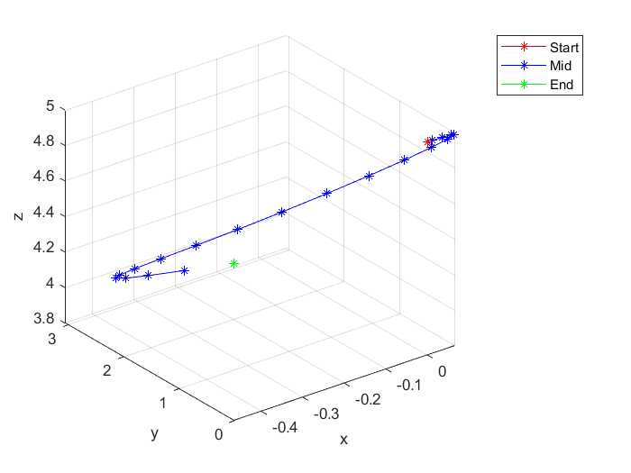

# FourierHermiteDynamicProgramming
Code repository for Fourier--Hermite Dynamic Programming for Optimal Control paper

<!-- ROADMAP -->
## Experiments

- [x] Quadcopter
<!-- Quadcopter trajectory -->

 

  

  <h3 align="center">Trajectory of Quadcopter</h3>

  

    
    { width=50% }
  

